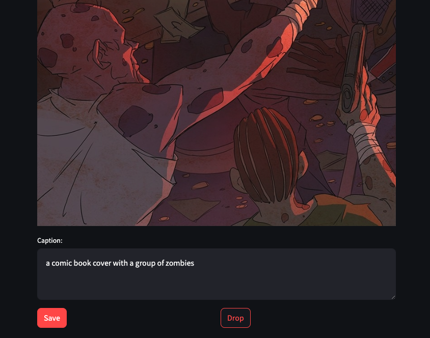

# Caption Handyman GUI Helper

This repository contains Streamlit GUI scripts for viewing and manual-captioning image-text pairs.




## Prerequisties

All you need is Python and Streamlit library.

```bash
pip install streamlit
```


## Directory Structure

Prepare directory structure like below:

```
.
├── image_dir/
│   ├── image1.jpg
│   ├── image2.jpg
│   └── ...
└── caption_dir/
    ├── image1.txt
    ├── image2.txt
    └── ...
```


## Usage

To run image-text viewer:

```bash
streamlit run streamlit_viewer.py -- --image_dir [IMAGE_DIR] --caption_dir [CAPTION_DIR]
```

To run image-text caption editor:

(You can edit caption in textbox, and save current image-text pair to output directory, or just drop it)

```bash
streamlit run streamlit_caption_helper.py -- --image_dir [IMAGE_DIR] --caption_dir [CAPTION_DIR] --output_dir [OUTPUT_DIR]
```
